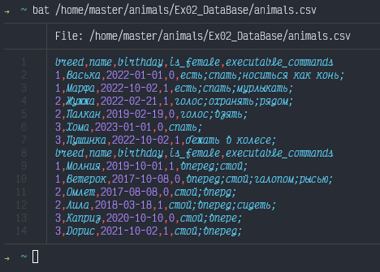

## Linux commands

**Задания 1 - 5**
1. Используя команду cat в терминале операционной системы Linux, создать
два файла Домашние животные (заполнив файл собаками, кошками,
хомяками) и Вьючные животными заполнив файл Лошадьми, верблюдами и
ослы), а затем объединить их. Просмотреть содержимое созданного файла.
Переименовать файл, дав ему новое имя (Друзья человека).
2. Создать директорию, переместить файл туда.
3. Подключить дополнительный репозиторий MySQL. Установить любой пакет
из этого репозитория.
4. Установить и удалить deb-пакет с помощью dpkg.
5. Выложить историю команд в терминале ubuntu

```Bash
master@master:~$ cat /etc/os-release
PRETTY_NAME="Ubuntu 22.04.2 LTS"
NAME="Ubuntu"
VERSION_ID="22.04"
VERSION="22.04.2 LTS (Jammy Jellyfish)"
VERSION_CODENAME=jammy
ID=ubuntu
ID_LIKE=debian
HOME_URL="https://www.ubuntu.com/"
SUPPORT_URL="https://help.ubuntu.com/"
BUG_REPORT_URL="https://bugs.launchpad.net/ubuntu/"
PRIVACY_POLICY_URL="https://www.ubuntu.com/legal/terms-and-policies/privacy-policy"
UBUNTU_CODENAME=jammy

master@master:~$ cat > PetsBreed.csv
Cat
Dog
Hamster
master@master:~$ cat PetsBreed.csv
Cat
Dog
Hamster
master@master:~$ cat > PackAnimalsBreed.csv
Horse
Camel
Donkey
master@master:~$ cat PackAnimalsBreed.csv
Horse
Camel
Donkey
master@master:~$ cat > Pets.csv
breed,name,birthday,is_female,executable_commands
1,Васька,2022-01-01,0,есть;спать;носиться как конь;
1,Марфа,2022-10-02,1,есть;спать;мурлыкать;
2,Жужжа,2022-02-21,1,голос;охранять;рядом;
2,Палкан,2019-02-19,0,голос;взять;
3,Хома,2023-01-01,0,спать;
3,Пушинка,2022-10-02,1,бежать в колесе;
master@master:~$ cat > PackAnimals.csv
breed,name,birthday,is_female,executable_commands
1,Молния,2019-10-01,1,вперед;стой;
1,Ветерок,2017-10-08,0,вперед;стой;галопом;рысью;
2,Омлет,2017-08-08,0,стой;вперед;
2,Лила,2018-03-18,1,стой;вперед;сидеть;
3,Каприз,2020-10-10,0,стой;вперед;
3,Дорис,2021-10-02,1,стой;вперед;
master@master:~$ cat Pets.csv PackAnimals.csv > animals.csv
master@master:~$ cat -n animals.csv
     1  breed,name,birthday,is_female,executable_commands
     2  1,Васька,2022-01-01,0,есть;спать;носиться как конь;
     3  1,Марфа,2022-10-02,1,есть;спать;мурлыкать;
     4  2,Жужжа,2022-02-21,1,голос;охранять;рядом;
     5  2,Палкан,2019-02-19,0,голос;взять;
     6  3,Хома,2023-01-01,0,спать;
     7  3,Пушинка,2022-10-02,1,бежать в колесе;
     8  breed,name,birthday,is_female,executable_commands
     9  1,Молния,2019-10-01,1,вперед;стой;
    10  1,Ветерок,2017-10-08,0,вперед;стой;галопом;рысью;
    11  2,Омлет,2017-08-08,0,стой;вперед;
    12  2,Лила,2018-03-18,1,стой;вперед;сидеть;
    13  3,Каприз,2020-10-10,0,стой;вперед;
    14  3,Дорис,2021-10-02,1,стой;вперед;
master@master:~$ mv animals.csv Human_friends.csv
master@master:~$ mkdir animals
master@master:~$ ll *.csv
-rw-rw-r-- 1 master master 836 фев 24 13:34 Human_friends.csv
-rw-rw-r-- 1 master master  21 фев 24 12:49 PackAnimalsBreed.csv
-rw-rw-r-- 1 master master 406 фев 24 13:26 PackAnimals.csv
-rw-rw-r-- 1 master master  16 фев 24 12:46 PetsBreed.csv
-rw-rw-r-- 1 master master 430 фев 24 13:18 Pets.csv
master@master:~$ ll *.csv
-rw-rw-r-- 1 master master 836 фев 24 13:34 Human_friends.csv
-rw-rw-r-- 1 master master  21 фев 24 12:49 PackAnimalsBreed.csv
-rw-rw-r-- 1 master master 406 фев 24 13:26 PackAnimals.csv
-rw-rw-r-- 1 master master  16 фев 24 12:46 PetsBreed.csv
-rw-rw-r-- 1 master master 430 фев 24 13:18 Pets.csv
master@master:~$ mv *.csv /home/master/animals/
master@master:~$ ls animals/
Human_friends.csv  PackAnimalsBreed.csv  PackAnimals.csv  PetsBreed.csv  Pets.csv
# дальше для удобства работы установил zsh и oh-my-zhs
# Добавим репозиторий MySQL
➜ wget https://dev.mysql.com/get/mysql-apt-config_0.8.24-1_all.deb
 mysql-apt-config_0.8.24-1_all.de 100%
 [=========================================>]  17,62K  --.-KB/s    in 0s
sudo dpkg -i mysql-apt-config_0.8.24-1_all.deb
sudo apt-get install mysql-server
# Проверим что запущен
➜ systemctl status mysql
● mysql.service - MySQL Community Server
     Loaded: loaded (/lib/systemd/system/mysql.service; enabled; vendor preset: enabled)
     Active: active (running) since Fri 2023-02-24 14:36:00 UTC; 1min 39s ago
    Process: 4176 ExecStartPre=/usr/share/mysql/mysql-systemd-start pre (code=exited, status=0/SUCCESS)
   Main PID: 4195 (mysqld)
     Status: "Server is operational"
      Tasks: 38 (limit: 4570)
     Memory: 365.3M
        CPU: 2.978s
     CGroup: /system.slice/mysql.service
             └─4195 /usr/sbin/mysqld
             
# Установить / удалить deb пакет
# Скачаем и установим bat - тоже что и cat, только красивее :)
➜  Downloads wget https://github.com/sharkdp/bat/releases/download/v0.8.0/bat_0.8.0_amd64.deb
➜  Downloads sudo dpkg -i ./bat_0.8.0_amd64.deb
```


```Bash
# Удалили
➜  Downloads sudo dpkg -r bat
(Чтение базы данных … на данный момент установлено 145344 файла и каталога.)
Удаляется bat (0.8.0) …
Обрабатываются триггеры для man-db (2.10.2-1) …
➜  Downloads bat /home/master/animals/Ex02_DataBase/Pets.csv
zsh: command not found: bat
```
