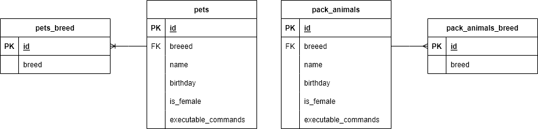

### Database

- Диаграмма базы данных



- Создать таблицы и заполнить их данными

```SQL
CREATE DATABASE human_friend;
use human_friend;

CREATE TABLE `pets_breed` (
	id INT PRIMARY KEY NOT NULL AUTO_INCREMENT,
  breed CHAR(50) NOT NULL UNIQUE
);

CREATE TABLE `pack_animals_breed` (
	id INT PRIMARY KEY NOT NULL AUTO_INCREMENT,
  breed CHAR(50) NOT NULL UNIQUE
);

CREATE TABLE `pets` (
	`id` INT PRIMARY KEY NOT NULL AUTO_INCREMENT,
  `breed` INT,
  `name` CHAR(100) NOT NULL,
  `birthday` DATE NOT NULL,
  `is_female` BOOL,
  `executable_commands` TEXT,
  CONSTRAINT fk_pets_breed_id FOREIGN KEY (breed) REFERENCES `pets_breed`(id)
);

CREATE TABLE `pack_animals` (
	`id` INT PRIMARY KEY NOT NULL AUTO_INCREMENT,
  `breed` INT,
  `name` CHAR(100) NOT NULL,
  `birthday` DATE NOT NULL,
  `is_female` BOOL,
  `executable_commands` TEXT,
  CONSTRAINT fk_pack_animals_breed_id FOREIGN KEY (breed) REFERENCES `pack_animals_breed`(id)
);


CREATE VIEW `animals` AS
		SELECT pets_breed.breed AS breed, name, birthday, is_female, executable_commands
  	FROM pets JOIN pets_breed ON (pets.breed = pets_breed.id)
  UNION ALL
  	SELECT pack_animals_breed.breed AS breed, name, birthday, is_female, executable_commands
  	FROM pack_animals JOIN pack_animals_breed ON (pack_animals.breed = pack_animals_breed.id)
  ORDER BY birthday DESC;

mysql> use human_friend;
Database changed

mysql> LOAD DATA LOCAL INFILE "/home/master/animals/Ex02_DataBase/PetsBreed.csv" INTO TABLE pets_breed FIELDS TERMINATED BY"," LINES TERMINATED BY"\n" (breed);
Query OK, 3 rows affected (0,00 sec)
Records: 3  Deleted: 0  Skipped: 0  Warnings: 0

mysql> LOAD DATA LOCAL INFILE "/home/master/animals/Ex02_DataBase/PackAnimalsBreed.csv" INTO TABLE pack_animals_breed FIELDS TERMINATED BY"," LINES TERMINATED BY"\n" (breed);
Query OK, 3 rows affected (0,02 sec)
Records: 3  Deleted: 0  Skipped: 0  Warnings: 0

mysql> LOAD DATA LOCAL INFILE "/home/master/animals/Ex02_DataBase/PackAnimals.csv" INTO TABLE pack_animals FIELDS TERMINATED BY"," LINES TERMINATED BY"\n" IGNORE 1 ROWS (breed,name,birthday,is_female,executable_commands);
Query OK, 6 rows affected, 18 warnings (0,01 sec)
Records: 6  Deleted: 0  Skipped: 0  Warnings: 18

mysql> LOAD DATA LOCAL INFILE "/home/master/animals/Ex02_DataBase/Pets.csv" INTO TABLE pets FIELDS TERMINATED BY"," LINES TERMINATED
 BY"\n" IGNORE 1 ROWS (breed,name,birthday,is_female,executable_commands);
Query OK, 6 rows affected, 18 warnings (0,01 sec)
Records: 6  Deleted: 0  Skipped: 0  Warnings: 18
```

10.  Удалив из таблицы верблюдов, т.к. верблюдов решили перевезти в другой
питомник на зимовку. Объединить таблицы лошади, и ослы в одну таблицу.
```SQL

```

11. Создать новую таблицу “молодые животные” в которую попадут все
животные старше 1 года, но младше 3 лет и в отдельном столбце с точностью
до месяца подсчитать возраст животных в новой таблице
```SQL

```

12. Объединить все таблицы в одну, при этом сохраняя поля, указывающие на
прошлую принадлежность к старым таблицам.
```SQL

```
